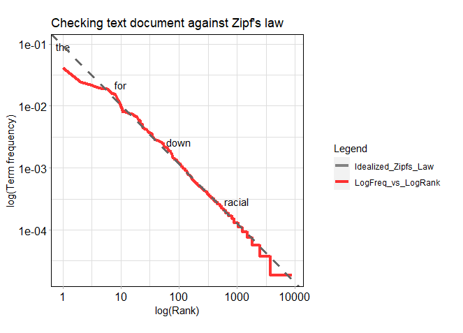

<style type="text/css">

h1.title {
  font-size: 26px;
  line-height: 130%;
  color: Black;
  text-align: center;
}

h2.subtitle {
  font-size: 13px;
  line-height: 120%;
  color: Black;
  text-align: center;
}

h4.author { /* Header 4 - and the author and data headers use this too  */
  font-size: 17px;
  font-family: "Arial";
  color: Black;
  text-align: center;
}
h4.date { /* Header 4 - and the author and data headers use this too  */
  font-size: 17px;
  font-family: "Arial", Times, serif;
  color: Black;
  text-align: center;
}

h4.abstract { /* Header 4 - and the author and data headers use this too  */
  font-size: 10px;
  font-family: "Arial", Times, serif;
  color: black;
  text-align: center;
}

h4.institute{ /* Header 4 - and the author and data headers use this too  */
  font-size: 10px;
  font-family: "Arial", Times, serif;
  color: black;
  text-align: center;
}

body, td {
   font-size: 14px;
}
code.r{
  font-size: 13px;
}
pre {
  font-size: 13px
}
h1 { /* Header 1 */
  font-size: 16px;
  color: DarkBlue;
}
h2 { /* Header 2 */
    font-size: 16px;
  color: DarkBlue;
}
h3 { /* Header 3 */
  font-size: 15px;
  font-family: "Times New Roman", Times, serif;
  color: DarkBlue;

</style>

```{r setup, include = FALSE}
knitr::opts_chunk$set(
  collapse = TRUE,
  comment = "#>"
)
```

```{r functions, include=FALSE}
# A function for captioning and referencing images
fig <- local({
    i <- 0
    ref <- list()
    list(
        cap=function(refName, text) {
            i <<- i + 1
            ref[[refName]] <<- i
            paste("Figure ", i, ": ", text, sep="")
        },
        ref=function(refName) {
            ref[[refName]]
        })
})
```


# Introduction

The `'opitools'` provides the mechanism for carrying out opinion impact analysis of a digital text document (DTD). The package functions can be categorized into two groups, namely (a) exploratory - for exploring terms in a document, e.g. importance of words and their statistical distribution, and (b) analytical - for computing metrics on the impacts of a theme or subject on the opinion expressed in a document. The potentials of `opitools` for application across a wide variety of domains is demonstrated with examples from the `law enforcement` to examine the impacts of covid-19 on the citizens' opinion of their neighbourhood policing; from `marketing research` to examine what features in and around a train station influence customers reviews of the train services; from `electoral politics` to examine the extent to which a political candidate drives viewers opinion of a political debate. 


### Set the Working directory

```{r, message=FALSE, eval=FALSE}
WORKING_DIR <- 'C:/R/Github/JGIS_Policing_COVID-19'

#setting working directory
setwd(WORKING_DIR)
```


### Instal libraries
```{r, include=TRUE, message=FALSE, eval=TRUE}
library(opitools) #for impact analysis
require(knitr) #for rendering the vignette
library(rvest)
library(kableExtra) #for designing tables
library(dplyr) #for data analysis
library(cowplot) #for plot design


```

# Example datasets

The following datasets will be employed in our demonstration. The datasets are automatically installed upon the installation of `Opitools`. 

```{r, echo=FALSE, include=FALSE}
col1 <- c("1", "2", "3")
col2 <- c("`policing_dtd`","`reviews_dtd`","`debate_dtd`")
col3 <- c("`Law Enforcement`","`Marketing Research`", "`Electoral Politics`")
col4 <- c("A digital text document (DTD) containing twitter posts, within a geographical neighbourhood, on police/policing during the 2020 COVID-19 pandemic", "A DTD containing customers reviews of the Piccadilly train station (Manchester, UK). The records cover from July 2016 to March 2021.", "A DTD containing individual comments on the video showing the debate between two United States presidential candidates (Donald Trump and Hillary Clinton) in September of 2016. (Credit: NBC News).")
col5 <- c("www.twitter.com", "www.tripadvisor.co.uk","www.youtube.com")
tble1 <- data.frame(col1, col2, col3, col4, col5)
tble1 <- tble1
```


```{r table1, results='asis', echo=FALSE, tidy.opts=list(width.cutoff=50)}
knitr::kable(tble1, caption = "Table 1. `Example datasets`", col.names = c("SN","Data","Application","Details", "Data Source")) %>%
  kable_styling(full_width = F) %>%
  column_spec(1, bold = T, border_right = T) %>%
  column_spec(2, width = "8em", background = "white") %>%
  column_spec(3, width = "12em", background = "white") %>%
  column_spec(4, width = "16em", background = "white")#%>%
  #row_spec(3:5, bold = T, color = "white", background = "#D7261E")
```
 

# Functions

The function in `'opitools'` can be categorized into two groups, namely (1) exploratory - for exploring terms or words in a text document, and (2) analytical - for computing metrics for the impact analysis. 

### Exploratory function

Table 2 shows two key exploratory functions embedded in `'opitools'`, namely `'word_distrib'` and `'word_imp'`. Details as follow:

```{r, echo=FALSE, include=FALSE}
col1 <- c("1", "2")
col2 <- c("`word_distrib`","`word_imp`")
col3 <- c("`Words Distribution`","`Importance of words (terms) embedded in a text document`")
col4 <- c("Examines the extent to which the terms (words) in a DTD follow the Zipf's distribution (Zipf 1934) - the ideal natural language model", "Produces a table or graphic that highlights the importance of individual terms (or words) in a DTD.")
tble2 <- data.frame(col1, col2, col3, col4)
tble2 <- tble2
```

```{r table2, results='asis', echo=FALSE, tidy.opts=list(width.cutoff=50)}
knitr::kable(tble2, caption = "Table 2. `Exploratory` functions", col.names = c("SN","Function","Title","Description")) %>%
  kable_styling(full_width = F) %>%
  column_spec(1, bold = T, border_right = T) %>%
  column_spec(2, width = "8em", background = "white") %>%
  column_spec(3, width = "12em", background = "white") %>%
  column_spec(4, width = "16em", background = "white")#%>%
  #row_spec(3:5, bold = T, color = "white", background = "#D7261E")
```


### Example data exploration

Below, the use of `'word_distrib'` and `'word_imp'` functions is demonstrated with the example datasets `'tweets'` (see documentations). The `'word_distrib'` can be used to answer a RQ such as; "How similar is a given DTD to the ideal natural language text?". In other words, does the word usage in a DTD follow the ideal natural language usage represeted by the Zipf's distribution [@Zipf1936]? Basically, the function examines the log rank-frequency of the terms across the document. The level of similarity is examined by the extent to which the frequency of each term is inversely proportional to their rank in a frequency table. Using a randomized Twitter data (embedded in the package), 

```{r, message=FALSE, include = TRUE, eval=FALSE}

# Load data
data(tweets)

# Get the texts
tweets_dat <- as.data.frame(tweets[,1])

# Run function
plt = word_distrib(textdoc = tweets_dat)

#Show Zipf's distribution:

plt$plot

```

```{r figs1, echo=FALSE, fig.width=5,fig.height=6,fig.align="center", fig.cap=fig$cap("figs1", "Data freq. plot vs. Zipf's distribution")}

```

For a natural language text, the Zipf's distribution plot has a negative slope with each term falling on a straight line. Any variance from this (ideal) trend can be attributed to imperfections in the term usage. For example, the presence of strange terms or 'made-up' words can cause a deviation from the ideal trend. The result of our example dataaset is shown in Figure `r fig$ref("figs1")`. The graph can be divided into the three sections: the upper, the middle and the lower sections. By fitting a regression line (an ideal Zipf's distribution), we can see what the slope of the upper section is quite different from the middle and the lower sections of the graph. The variance at the high rank terms (usually, common terms, such as 'the', 'of', and 'at',) indicates an imperfection because of lack of perfect alignment with the straight line. For Twitter data, this variance suggests a significant use of abbreviated terms, such as using "&" or "nd" instead of the term "`and`". Apart from the small variance at the upper section of the graph, we can state that the law holds within most parts of the document.

The second exploratory function `'word_imp'` can be used to highlight the importance of each terms in a DTD. The level of importance can then be used to identify different themes (or subjects) from the DTD. Two measures, namely (i) `'term frequency (tf)'` and `term frequency inverse document frequency (tf-idf)` [@Silge2016] can be used to highlight the importance of terms in a DTD. In Figure 2, results 1, 2 and 3 are generated from the datasets; `policing_dtd`, `reviews_dtd` and `debate_dtd`, respectively. The results of the measures `'tf'` and `'tf_idf'` for each data sample are labeled as A and B, respectively. The function draws from `wordcloud2` package in R [@Dawei2018], in order to highlight words importance as shown in Figure 2.

```{r, message=FALSE, include = TRUE, eval=FALSE}

#Load datasets

data("policing_dtd")
data("reviews_dtd")
data("debate_dtd")


#Words importance of public tweets on neighbourhood policing 
#based on  (a) ‘tf’ (b) 'tf-idf'  
p1a <- word_imp(textdoc = policing_dtd, metric= "tf", 
                           words_to_filter=c("police","policing"))

p1b <- word_imp(textdoc = policing_dtd, metric= "tf-idf", 
                           words_to_filter=c("police","policing"))

#Note: 'words_to_filter' parameter is used to eliminate non-necessary words that 
#may be too dominant in the DTD.

#Words importance of customer reviews of a transport service 
#based on (a) ‘tf’ (b) 'tf-idf' 
p2a <- word_imp(textdoc = reviews_dtd, metric= "tf", 
                words_to_filter=c("station")) 

p2b <- word_imp(textdoc = reviews_dtd, metric= "tf-idf",  
                words_to_filter=c("station")) 

#Words importance  of comments on a video of a political debate 
#based on (a) ‘tf’ (b) 'tf-idf'
p3a <- word_imp(textdoc = debate_dtd, metric= "tf", 
                words_to_filter=c("trump","hillary")) 

p3b <- word_imp(textdoc = debate_dtd, metric= "tf-idf", 
                words_to_filter=c("trump","hillary")) 

#outputs
p1a$plot; p1b$plot; p2a$plot; p2b$plot; p3a$plot; p3b$plot

```

```{r figs2, echo=FALSE, fig.width=3,fig.height=4,fig.align="center", fig.cap=fig$cap("figs2", "Highlighting words importance from a DTD")}
knitr::include_graphics("wordcloud.png")
```

In Figure `r fig$ref("figs2")`, the size of a word represents its level of importance according to a selected metric (i.e. 'tf' or 'tf-idf'). From each representation, a user can easily identify (related) words that denote certain themes or subjects within the document. In Figure 1A, words such as 'lockdown', 'infect' and 'covid', refer to the sentiments relating to the pandemic under which the police were operating as at the time tweets were posted. "Does the pandemic has any significant impacts on the public opinion of the police activities during the period?". This is an example of the RQs that can be investigated using `Opitools`. On the other hand, Figure 1B shows that the word importance may vary significantly by the choice of the measure between 'tf' and 'tf-idf'. Figure 1B shows that a significant amount of the most important words using `tf-idf` are distinct from those ones resulting from using `tf`. 

In Figure 2A, we see that related words, such as 'restaurant', 'shops', 'food' and 'coffee', denoting `refreshment items`, are highlighted as been the most important to the customers. "`Do these refreshment items impact the overall customers' opinion of the train services?`". Similarly, related words such as 'board', 'map' and 'display', denoting `signages` around the station may have influenced customers opinion of the station.


### Analytical functions

Table 3 shows the list of analytical functions of the `'Opitools'` package.

```{r, echo=FALSE, include=FALSE}
col1 <- c("3", "4", "5")
col2 <- c("`opi_score`","`opi_sim`", "`opi_impact`")
col3 <- c("`Computes the overall opinion score of a text document`",
          "`Simulates the opinion expectation distribution of a text document`",
          "`Computes the statistical significance of impacts of a specified/selected theme (or subject) on the overall opinion score of a document`")
col4 <- c("Given a text document, this function computes the overall opinion score based on the proportion of text records classified as expressing positive, negative or a neutral sentiment about the subject.",  "This function simulates the expectation distribution of the observed opinion score (computed using the `opi_score` function).",  "This function assesses the impacts of a theme (or subject) on the overall opinion computed for a text document. The text records relating to the theme in question should be identified and provided as input to this function")
tble3 <- data.frame(col1, col2, col3, col4)
tble3<- tble3
```

```{r table3, results='asis', echo=FALSE, tidy.opts=list(width.cutoff=50)}
knitr::kable(tble3, caption = "Table 3. `Impact Analytical` function", col.names = c("SN","Function","Title","Description")) %>%
  kable_styling(full_width = F) %>%
  column_spec(1, bold = T, border_right = T) %>%
  column_spec(2, width = "8em", background = "white") %>%
  column_spec(3, width = "12em", background = "white") %>%
  column_spec(4, width = "16em", background = "white")#%>%
  #row_spec(3:5, bold = T, color = "white", background = "#D7261E")
```

The key analytical function is the `opi_impact()` which draws from `opi_score()` and `opi_sim()` to compute the observed opinion score and the expectations, respectively. The observed opinion score is compared with the expectation in order to derive the statistical significance of impacts of a specified/selected theme. Using the example dataset `policing_dtd`:  

The impact analysis can be performed as follows: 

```{r, message=FALSE, include = TRUE, eval=FALSE}

#Application: Law enforcement

#Load DTD
data(policing_dtd)

#Load theme keywords
data(covid_theme)

# Run the analysis
output1 <- opi_impact(policing_dtd, theme_keys=covid_theme, metric = 1,
                       fun = NULL, nsim = 99, alternative="two.sided",
                       quiet=TRUE)
print(output1)

```

To print results: 

```{r, echo=TRUE, message=FALSE, eval=FALSE}

> output1

$test
[1] "Test of significance (Randomization testing)"

$criterion
[1] "two.sided"

$exp_summary
   Min. 1st Qu.  Median    Mean 3rd Qu.    Max. 
 -8.240  -5.880  -5.880  -4.837  -3.530  -1.180 

$p_table

|observed_score |S_beat |nsim |pvalue |signif |
|:--------------|:------|:----|:------|:------|
|-5.88          |51     |99   |0.52   |'      |

$p_key
[1] "0.99'"   "0.05*"   "0.025**" "0.01***"

$p_formula
[1] "(S_beat + 1)/(nsim + 1)"

$plot
```

* The descriptions of output variables are as follow:

  + `test` - title of the analysis

  + `criterion` - criterion for determining the significance value

  + `exp_summary` - summary of expected opinion scores
  
  + `p_table` - details of Statistical Significance

  + `p_key` - keys for interpreting the statistical significance value

  + `p_formula` - function of opinion score employed
  
  + `plot` - plot showing Percentage proportion of classes


The output shows an overall negative opinion (`-5.88`) of the public on the neighbourhood policing, and that the pandemic has not had a significant impacts (`pvalue` = 0.52) on the opinion expressed by the public. 

To display the graphics showing the proportion of various sentiment classes (as in Figure `r fig$ref("figs3")`), type `output$plot` in the console.

```{r figs3, echo=FALSE, fig.width=5,fig.height=6,fig.align="center", fig.cap=fig$cap("figs3", "Percentage proportion of classes")}
knitr::include_graphics("likert.png")
```

Table 4 summarizes the results of impact analysis using all the example datasets in Table 1 with their respective research questions (RQs). The outputs from the law enforcement application (as in above) is entered as the first record of the table. In each example, we employed the same score function (`metric = 1`, i.e. `polarity score = (P - N)/(P + N)*100`, where `P` and `N` represent `positive` and `negative` sentiments, respectively). See the documentation for details.

```{r, echo=FALSE, include=FALSE}
col1 <- c("1", "2a", "2b","3")
col2 <- c("Does COVID-19 pandemic influence public opinion on neighourhood policing?", "Do the refreshment outlets/items impact customers' opinion of the Piccadilly train services?", "Do the signages influence customers' opinion of the Piccadilly train services?", "How does the democratic candidate (Hillary Clinton) affects viewers' opinion of the presidential debate?")
col3 <- c("`policing_dtd`","`reviews_dtd`", "`reviews_dtd`", "`debate_dtd`")
col4 <- c("`covid_theme`","`refreshment_theme`", "`signage_theme`", "direct input")
col5 <- c("two.sided", "two.sided", "two.sided", "two.sided")
col6 <- c("Polarity score", "Polarity score", "Polarity score", "Polarity score")
col7 <- c("-5.88", "67.92", "67.92", "-0.33")
col8 <- c("0.52", "0.01", "0.1", "0.93")
tble4 <- data.frame(col1, col2, col3, col4, col5, col6, col7, col8)
tble4 <- tble4
```


```{r table4, results='asis', echo=FALSE, tidy.opts=list(width.cutoff=50)}
knitr::kable(tble4, caption = "Table 4. `Impact analysis`", col.names = c("SN.","RQs","Primary data","theme_keys","criterion", "Score function", "Observed score (S)", "p-value")) %>%
  kable_styling(full_width = F) %>%
  column_spec(1, bold = T, border_right = T) %>%
  column_spec(2, width = "26em", background = "white") %>%
  column_spec(3, width = "8em", background = "white") %>%
  column_spec(4, width = "8em", background = "white") %>%
  column_spec(5, width = "8em", background = "white") %>%
  column_spec(6, width = "8em", background = "white") %>%
  column_spec(7, width = "8em", background = "white")%>%
  column_spec(8, width = "8em", background = "white")#%>%
  #row_spec(3:5, bold = T, color = "white", background = "#D7261E")
```
 
In the marketing application (2a & 2b), we tested the impacts of two themes, namely; `refreshment items/outlets` and the `signages`, on the customers' opinions of the train services. The statistics (`S=67.92, pvalue = 0.01`) show an overall positive customers' opinions of the train station or services, with the refreshments items/outlets (in and around the station) contributing significantly towards the positive opinions. On the other hand, the result (2b) indicates that the signages (in and around the station) have no significant influence (p=0.1) on the positive review of the train service. 

The last application (electoral politics) attempts to identify factors that may have contributed to viewers opinion of a presidential debate. The statistics (`S=-0.33, pvalue = 0.93`) show that viewers opinion of the debate is negative. However, viewers opinion of the democratic candidate (Hillary Clinton) has no impacts of their overall negative opinion of the debate.

### Using a user-defined opinion score function

An opinion score function may be defined in a variety of ways depending on the application domain. For instance, [@Razorfish2019] defines customers' opinion score of a product brand as `score = (P + O - N)/(P + O + N)`, where `P`, `O`, and `N`, represent the amount/proportion of positive, neutral and negative, sentiments, respectively. In order for a user to be able to plug-in their own opinion score function, we provided the parameter `fun` in the `opi_impact` function. This allow users to integrate new functions and test new theories. Employing the example function, we can re-run the analysis as follows: 

(a) Define the user-defined function: 

```{r, echo=TRUE, message=FALSE, eval=FALSE}

#The equation
Score = (P + O - N)/(P + O + N)

#Corresponding function
myfun <- function(P, N, O){
   score <- (P + O - N)/(P + O + N)
   return(score)
}

```

(b) Integrate the function and run analysis

```{r, echo=TRUE, message=FALSE, eval=FALSE}

output <- opi_impact(debate_dtd, theme_keys=keys, metric = 5,
                       fun = myfun, nsim = 99, alternative="two.sided",
                       quiet=TRUE)
```


# Conclusion

The `opitools` package has been developed in order to address the lack of mechanism for carrying out impact analysis of opinions for digital text document (DTD). The utility of the package was originally demonstrated in [@Adepeju2021] in its application in law enforcement domain. In addition, this vignette demonstrates the potentials of the package for application across a wide variety of areas, with examples from marketing and political domains. This package is being updated on a regular basis to add more functionalities. 

We encourage users to report any bugs encountered while using the package so that they can be fixed immediately. Welcome contributions to this package which will be acknowledged accordingly. 

# References
