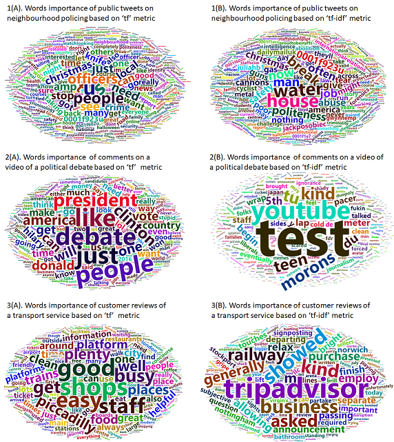
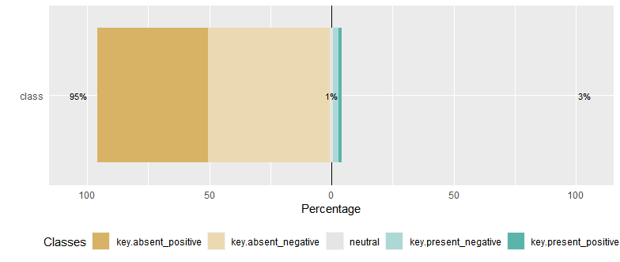

<style type="text/css">

h1.title {
  font-size: 26px;
  line-height: 130%;
  color: Black;
  text-align: center;
}

h2.subtitle {
  font-size: 13px;
  line-height: 120%;
  color: Black;
  text-align: center;
}

h4.author { /* Header 4 - and the author and data headers use this too  */
  font-size: 17px;
  font-family: "Arial";
  color: Black;
  text-align: center;
}
h4.date { /* Header 4 - and the author and data headers use this too  */
  font-size: 17px;
  font-family: "Arial", Times, serif;
  color: Black;
  text-align: center;
}

h4.abstract { /* Header 4 - and the author and data headers use this too  */
  font-size: 10px;
  font-family: "Arial", Times, serif;
  color: black;
  text-align: center;
}

h4.institute{ /* Header 4 - and the author and data headers use this too  */
  font-size: 10px;
  font-family: "Arial", Times, serif;
  color: black;
  text-align: center;
}

body, td {
   font-size: 14px;
}
code.r{
  font-size: 13px;
}
pre {
  font-size: 13px
}
h1 { /* Header 1 */
  font-size: 16px;
  color: DarkBlue;
}
h2 { /* Header 2 */
    font-size: 16px;
  color: DarkBlue;
}
h3 { /* Header 3 */
  font-size: 15px;
  font-family: "Times New Roman", Times, serif;
  color: DarkBlue;

</style>

```{r setup, include = FALSE}
knitr::opts_chunk$set(
  collapse = TRUE,
  comment = "#>"
)
```

```{r functions, include=FALSE}
# A function for captioning and referencing images
fig <- local({
    i <- 0
    ref <- list()
    list(
        cap=function(refName, text) {
            i <<- i + 1
            ref[[refName]] <<- i
            paste("Figure ", i, ": ", text, sep="")
        },
        ref=function(refName) {
            ref[[refName]]
        })
})
```


# Introduction

The development of `'opitools'` is to address the lack of tools for carrying out opinion impact analysis of a digital text document (DTD). The package functions can be categorized into two groups, namely (1) exploratory - for exploring terms in a document, e.g. importance of words and their statistical distribution, and (2) analytical - for computing metrics for the impact analysis. The potential of `opitools` for application to a wide variety of domains is demonstrated in this vignette with examples from the law enforcement, transport and politics.


### Setting the Working directory

```{r, message=FALSE, eval=FALSE}
WORKING_DIR <- 'C:/R/Github/JGIS_Policing_COVID-19'

#setting working directory
setwd(WORKING_DIR)
```


### Installing libraries
```{r, include=TRUE, message=FALSE, eval=TRUE}

library(opitools) #for impact analysis
require(knitr)
library(kableExtra)
library(dplyr)
#library(rtweet) #for data download
#library(twitteR) #for setting up Twitter authorization
#library(wordcloud2)
#library(tibble)
#library(tm)
#library(dplyr)

```

# Example datasets

In order to demonstrate the utility of `opitools` for application in a wide variety of domains, the following example datasets are used:

```{r, echo=FALSE, include=FALSE}
col1 <- c("1", "2", "3")
col2 <- c("`policing_dtd`","`reviews_dtd`","`debate_dtd`")
col3 <- c("`Law Enforcement`","`Transport`", "`Politics`")
col4 <- c("A digital text document (DTD) containing twitter posts on police/policing during the 2020 COVID-19 pandemic", "A DTD containing customer reviews of the Piccadilly train station (Manchester, uk). Data is downloaded from the www.tripadvisor.co.uk'. The records cover from July 2016 to March 2021."," A DTD containing individual comments on the video showing the debate between two US presidential nominees (Donald Trump and Hillary Clinton) in Sept. 2016. (Credit: NBC News).")
col5 <- c("www.twitter.com", "www.tripadvisor.co.uk","www.youtube.com")
tble1 <- data.frame(col1, col2, col3, col4, col5)
tble1 <- tble1
```


```{r table1, results='asis', echo=FALSE, tidy.opts=list(width.cutoff=50)}
knitr::kable(tble1, caption = "Table 1. `Example datasets`", col.names = c("SN","Data","Application","Details", "Data Source")) %>%
  kable_styling(full_width = F) %>%
  column_spec(1, bold = T, border_right = T) %>%
  column_spec(2, width = "8em", background = "white") %>%
  column_spec(3, width = "12em", background = "white") %>%
  column_spec(4, width = "16em", background = "white")#%>%
  #row_spec(3:5, bold = T, color = "white", background = "#D7261E")
```
 

# Functions

The function in `'opitools'` can be categorized into two groups, namely (1) exploratory - for exploring terms in a document, e.g. importance of words and their statistical distribution, and (2) analytical - for computing metrics for the impact analysis. 

### Exploratory function

Table 2 shows two exploratory functions embedded in `'opitools'`, namely `'word_distrib'` and `'word_importance'`. Details as follow:

```{r, echo=FALSE, include=FALSE}
col1 <- c("1", "2")
col2 <- c("`word_distrib`","`word_importance`")
col3 <- c("`Words Distribution`","`Importance of words (terms) embedded in a text document`")
col4 <- c("Examines the extent to which words in a DTD follow the Zipf's distribution (Zipf 1934). The Zipf's distribution  models the ideal natural language text", "Produces a table or graphic that highlights the importance of individual words(terms) in a DTD.")
tble2 <- data.frame(col1, col2, col3, col4)
tble2 <- tble2
```

```{r table2, results='asis', echo=FALSE, tidy.opts=list(width.cutoff=50)}
knitr::kable(tble2, caption = "Table 2. `Exploratory` functions", col.names = c("SN","Function","Title","Description")) %>%
  kable_styling(full_width = F) %>%
  column_spec(1, bold = T, border_right = T) %>%
  column_spec(2, width = "8em", background = "white") %>%
  column_spec(3, width = "12em", background = "white") %>%
  column_spec(4, width = "16em", background = "white")#%>%
  #row_spec(3:5, bold = T, color = "white", background = "#D7261E")
```


### Example data exploration

Below the use of `'word_distrib'` and `'word_importance'` is demonstrated on our example datasets. The `'word_distrib'` can be used to answer the question: "How close to an ideal natural language is the content of a DTD?". In other words, does the word usage in a DTD follow a normal natural language? The Zipf's distribution [@Zipf1936] is considered the model of an ideal natural language. The `'word_distrib'` function helps to model a DTD in terms of a Zipf's distribution by examining the log rank-frequency of the DTD. In the model, we expect the frequency of each word to be inversely proportional to its rank in a frequency table (see Figure `r fig$ref("figs1")`). Using a randomised Twitter data (embedded in the package), 

```{r, message=FALSE, include = TRUE, eval=FALSE}

# Load data
data(tweets)

# Get the texts
tweets_dat <- as.data.frame(tweets[,1])

# Run function
plt = word_distrib(textdoc = tweets_dat)

#Show Zipf's distribution:

plt$plot

```

```{r figs1, echo=FALSE, fig.width=5,fig.height=6,fig.align="center", fig.cap=fig$cap("figs1", "Data freq. plot vs. Zipf's distribution")}
knitr::include_graphics("zipf.png")
```

For a natural language text, the Zipf's distribution plot has a negative slope with all points falling on a straight line. Any deviation from this ideal trend line can be attributed to imperfections in the word usage. For example, the presence of a wide range of strange terms or made-up words can cause an imperfection of the text document. From Figure `r fig$ref("figs1")` the graph can be divided into the three sections: the upper, the middle and the lower sections. By fitting a regression line (an the ideal Zipf's distribution), we can see what the slope of the upper section is quite different from the middle and the lower sections of the graph. The deviation at the high rank indicate an imperfection because a corpus of English language would generally contain adequate number of common words, such as 'the', 'of', and 'at', in order to ensure alignment on a straight line. For social media data, this deviation can suggests a significant use of a wide range of abbreviation of common words, e.g. using "&" or "nd" instead of the word "and". Apart from the small deviation at the upper section of the graph, we can state that the law holds within most parts of our Twitter text document.

## Identifying important words

### Analytical functions

, while Table 3 shows the list of impact analytical functions in the `'opitools'` package.


# Impact Analysis

```{r, echo=FALSE, include=FALSE}
col1 <- c("3", "4", "5")
col2 <- c("`opi_score`","`opi_sim`", "`opi_impact`")
col3 <- c("`Opinion score of a text document`",
          "`Simulates the opinion expectation distribution of a text document`",
          "`Statistical assessment of impacts of a specified theme (or subject) from a document`")
col4 <- c("Given a text document, this function computes the overall opinion score based on the proportion of text records classified as expressing positive, negative or a neutral sentiment about the subject.",  "This function simulates the expectation distribution of the observed opinion score (computed using the `opi_score` function).",  "This function assesses the impacts of a theme (or subject) on the overall opinion computed for a text document. The text records relating to the theme in question should be identified and provided as input to this function")
tble3 <- data.frame(col1, col2, col3, col4)
tble3<- tble3
```

```{r table3, results='asis', echo=FALSE, tidy.opts=list(width.cutoff=50)}
knitr::kable(tble3, caption = "Table 3. `Impact Analytical` function", col.names = c("SN","Function","Title","Description")) %>%
  kable_styling(full_width = F) %>%
  column_spec(1, bold = T, border_right = T) %>%
  column_spec(2, width = "8em", background = "white") %>%
  column_spec(3, width = "12em", background = "white") %>%
  column_spec(4, width = "16em", background = "white")#%>%
  #row_spec(3:5, bold = T, color = "white", background = "#D7261E")
```

Now, in order to assess the impacts of COVID-19 pandemic (a secondary subject) on the main subject of the text document, i.e. neighbourhood policing, We need to first identify keywords that relate to the former. A user can employ any relevant analytical approach in order to identify such keywords. An example of a tool that can be used is the `wordcloud`, which may be used to reveal important words from within a text document.

```{r, message=FALSE, include = TRUE, eval=FALSE}

dat <- list(tweets_dat)

series <- tibble()

#tokenize document
series <- tibble(text = as.character(unlist(dat)))%>%
  unnest_tokens(word, text)%>% #tokenize
  dplyr::select(everything())

#removing stopwords
tokenize_series <- series[!series$word %in% stopwords("english"),]

#compute term frequencies
doc_words <- tokenize_series %>%
  dplyr::count(word, sort = TRUE) %>%
  dplyr::ungroup() %>%
  dplyr::mutate(len=nchar(word)) %>% 
  #remove words with character length <= 2
  dplyr::filter(len > 2)%>%
  data.frame() %>%
  dplyr::rename(freq=n)%>%
  dplyr::select(-c(len))%>%
  #removing the words, '' & '' because of 
  #their dominance
  dplyr::filter(!word %in% c("police", "policing")) 


row.names(doc_words) <- doc_words$word

#use only the top 1000 words
wordcloud2(data=doc_words[1:1000,], size = 0.7, shape = 'pentagon')

```

```{r figs2, echo=FALSE, fig.width=3,fig.height=4,fig.align="center", fig.cap=fig$cap("figs2", "Detecting important words from within the document")}

```

From the  `wordcloud` (i.e. `r fig$ref("figs2")`), the size of the words represent their respective frequencies (importance) across the document. Keywords relating to the COVID-19 pandemic are circled in red. In similar fashion, a user can identify keywords that relate to several other subjects that may have impacted neighbourhood policing during the data period. A list of `COVID-19 pandemic` related keywords are supplied with the `opitools` package. They can be assessed by typing: 


```r

> covid_keys 

#          keys
#1     pandemic
#2    pandemics
#3     lockdown
#4    lockdowns
#5       corona
#6  coronavirus
#7        covid
#8      covid19
#9     covid-19
#10       virus
#11     viruses
#12  quarantine
#13      infect
#14     infects
#15   infecting
#16    infected

```

The impact analysis can be performed as follows: 

```{r, message=FALSE, include = TRUE, eval=FALSE}

# call data
data(tweets)

# Get an n x 1 text document
tweets_dat <- as.data.frame(tweets[,1])

# Run the analysis

output <- opi_impact(tweets_dat, sec_keywords=covid_keys, metric = 1,
                       fun = NULL, nsim = 99, alternative="two.sided",
                       quiet=TRUE)
                       
```

To print results: 

```{r, echo=TRUE, message=FALSE, eval=FALSE}
output

#> $test
#> [1] "Test of significance (Randomization testing)"
#> 
#> $criterion
#> [1] "two.sided"
#> 
#> $exp_summary
#>    Min. 1st Qu.  Median    Mean 3rd Qu.    Max. 
#>  -27.80  -26.52  -26.10  -26.13  -25.75  -24.26 
#> 
#> $p_table
#> 
#> 
#> observed_score   S_beat   nsim   pvalue   signif 
#> ---------------  -------  -----  -------  -------
#> -28.23           0        99     0.01     ***    
#> 
#> $p_key
#> [1] "0.99'"   "0.05*"   "0.025**" "0.01***"
#> 
#> $p_formula
#> [1] "(S_beat + 1)/(nsim + 1)"
```

* The descriptions of output variables are as follow:

  + `test` - title of the analysis

  + `criterion` - criterion for determining the significance value

  + `exp_summary` - summary of expected opinion scores
  
  + `p_table` - details of Statistical Significance

  + `p_key` - keys for interpreting the statistical significance value

  + `p_formula` - function of opinion score employed
  
  + `plot` - plot showing Percentage proportion of classes


The output shows that COVID-19 pandemic has had a significant impacts on the public opinion concerning neighbourhood policing. This is indicated by the opinion scores -28.23 and a `pvalue` of 0.01. To display the graphics showing the proportion of various sentiment classes (as in Figure `r fig$ref("figs3")`), type `output$plot` in the console.

```{r figs3, echo=FALSE, fig.width=5,fig.height=6,fig.align="center", fig.cap=fig$cap("figs3", "Percentage proportion of classes")}

```


## Using a user-defined opinion score function

As the definition of opinion score function may vary from one application field to another, a user can specify a pre-defined opinion score function. For instance, [@Razorfish2019] defines opinion score of a product brand as `score = (P + O - N)/(P + O + N)`, where `P`, `O`, and `N`, represent the amount/proportion of positive, neutral and negative, sentiments, respectively. Using a user-define function, the analysis can be re-run as follows: 

First define the function: 

```{r, echo=TRUE, message=FALSE, eval=FALSE}

#define opinion score function
myfun <- function(P, N, O){
   score <- (P + O - N)/(P + O + N)
   return(score)
}

```

Re-run impact analysis

```{r, echo=TRUE, message=FALSE, eval=FALSE}

results <- opi_impact(tweets_dat, sec_keywords=covid_keys, metric = 5,
                       fun = myfun, nsim = 99, alternative="two.sided",
                       quiet=TRUE)
```


Print results: 

```{r, echo=TRUE, message=FALSE, eval=FALSE}

print(results)

#> $test
#> [1] "Test of significance (Randomization testing)"
#> 
#> $criterion
#> [1] "two.sided"
#> 
#> $exp_summary
#>    Min. 1st Qu.  Median    Mean 3rd Qu.    Max. 
#>  -27.80  -26.52  -26.10  -26.13  -25.75  -24.26 
#> 
#> $p_table
#> 
#> 
#> observed_score       S_beat   nsim   pvalue   signif 
#> -------------------  -------  -----  -------  -------
#> -0.234129692832764   99       99     1        NA     
#> 
#> $p_key
#> [1] "0.99'"   "0.05*"   "0.025**" "0.01***"
#> 
#> $p_formula
#> [1] "(S_beat + 1)/(nsim + 1)"

```

Based on the user defined opinion score function, the new opinion score is estimated as -0.234, while the `pvalue` now equals to 1 (non-significant). This implies that the outcome of whether a secondary subject has had a significant impact on the primary subject is also dependent on the opinion score function specified.


# Conclusion

The `opitools` package has been developed in order to aid the replication of the study [@Adepeju2021] for other application fields. In essence, the utility of the functions contained in this package is not limited to law enforcement(s) and public health, but rather can be applicable to several other public services more generally. This package is being updated on a regular basis to add more functionalities. 

We encourage users to report any bugs encountered while using the package so that they can be fixed immediately. Welcome contributions to this package which will be acknowledged accordingly. 

# References
